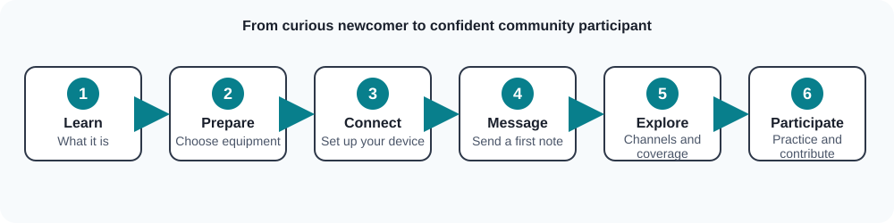

# Harnett Mesh

**Community-powered, off-grid communications.**

Harnett Mesh is a community communications initiative being developed by members of
Harnett County AuxComm. It is intended to provide an additional way for people in
Harnett County, North Carolina, to exchange text messages without depending on
cellular service or Internet access.

The project uses MeshCore software and LoRa radio technology to support a shared,
community-accessible network. The goal is more than deploying repeaters: Harnett
Mesh is building a documented and understandable service that residents can
learn, use, and help improve.

## Get Started with Harnett Mesh

New to Harnett Mesh? Start with the
[beginner getting-started guide](docs/getting-started.md).

## Explore Harnett Mesh

Follow the documentation in this order if you are new to the project:

1. [About Harnett Mesh](docs/overview.md) — Learn what the project is, why it
   exists, and how the network works at a high level.
2. [Getting Started](docs/getting-started.md) — Learn what you may need and
   follow the planned setup and first-message journey.
3. [Community Channels](docs/channels.md) — Understand the planned channel
   types and etiquette.
4. [Coverage](docs/coverage.md) — Learn how to interpret public coverage
   information and its limitations.
5. [Troubleshooting](docs/troubleshooting.md) — Find guidance when something
   does not work as expected.
6. [FAQ](docs/faq.md) — Get answers to common beginner questions.

You can also visit the [documentation index](docs/README.md) or learn about
[Network Infrastructure](infrastructure/README.md). The infrastructure page
describes the types and roles supporting Harnett Mesh without publishing
sensitive physical infrastructure information. To help improve this project,
see [Contributing](CONTRIBUTING.md).

## Why it exists

Everyday communications are useful practice for resilient communications. Harnett
Mesh aims to make it straightforward for someone with little or no radio
experience to join the network, understand its limits, and communicate with
others. A familiar tool is more useful during an outage or other disruption than
one that a community has never tried.

## Goals

- Provide an additional text communication method independent of cellular and
  Internet service.
- Maintain shared MeshCore infrastructure for community users.
- Make participation approachable for beginners.
- Publish useful, generalized coverage information.
- Encourage normal use, experimentation, and education before an emergency.
- Add a community communications capability when conventional infrastructure is
  degraded or unavailable.

## Project status

Harnett Mesh is in the planning and early-development phase. Network standards,
device guidance, channel definitions, coverage data, and onboarding instructions
are still being developed. See the documentation for current information and
items marked **TBD**.

## Coverage plans

The project plans to publish a public coverage map using generalized categories
such as Strong, Good, Marginal, and Untested. The map will distinguish estimated
coverage from field-verified coverage and will not display exact repeater or
infrastructure locations. See [the community coverage guide](docs/coverage.md)
and the [technical field-testing methodology](coverage/methodology.md).

## How to participate

As the project develops, community members will be able to learn about compatible
devices, follow a beginner-friendly onboarding guide, test coverage, participate
in community channels, and suggest improvements. The specific devices,
configuration values, channel names, and participation process are **TBD**.

## Important limitations

Harnett Mesh is not an official Harnett County government communications service.
It does not replace 911, public-safety communications, cellular networks,
amateur-radio emergency networks, or other established emergency communications
systems. **Do not use Harnett Mesh to contact 911 or assume that a message will
be delivered in an emergency.** Use established emergency services and
communications procedures when needed.

## Contributing

Documentation improvements, testing feedback, and community ideas are welcome.
Read [CONTRIBUTING.md](CONTRIBUTING.md) before opening an issue or pull request.

---

[About Harnett Mesh](docs/overview.md) • [Get Started](docs/getting-started.md) •
[Coverage](docs/coverage.md) • [Channels](docs/channels.md) •
[Troubleshooting](docs/troubleshooting.md) • [FAQ](docs/faq.md)
